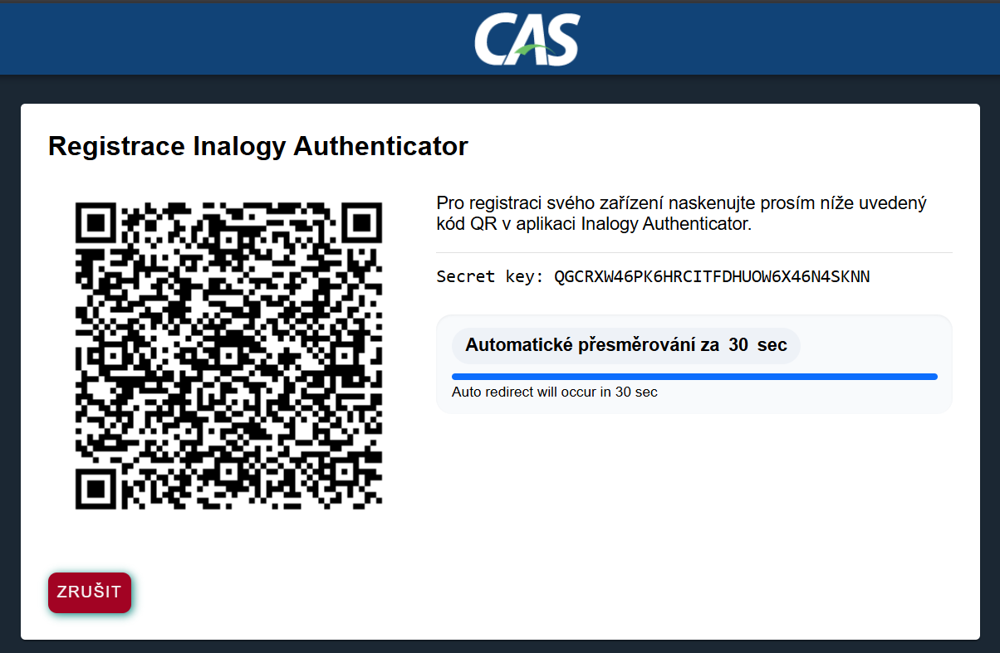
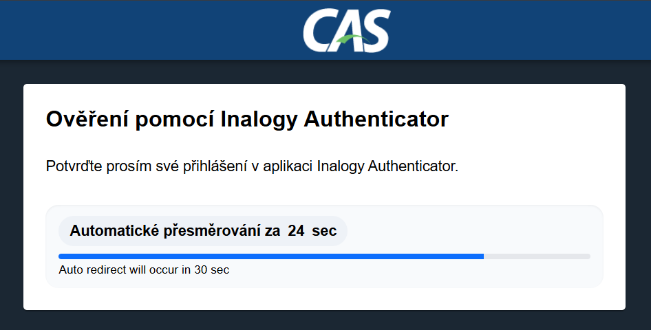
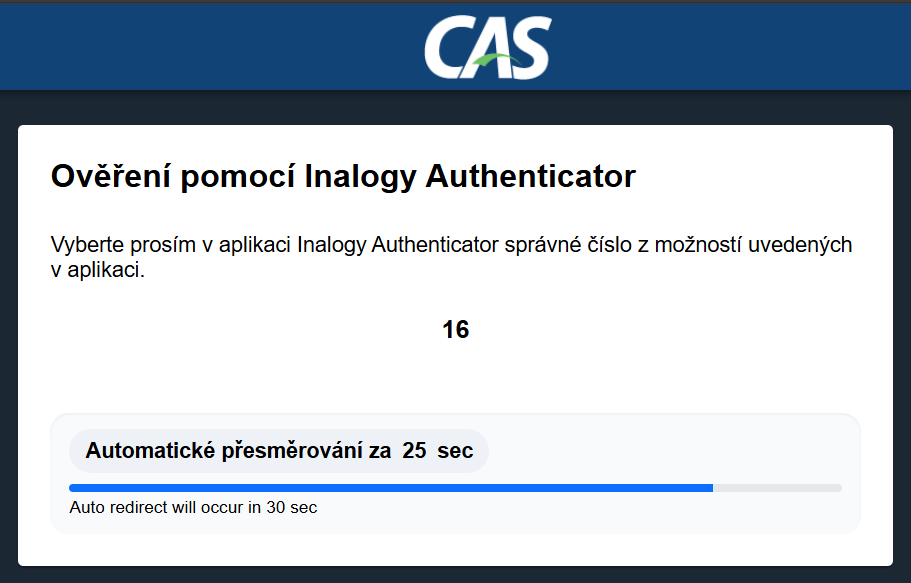
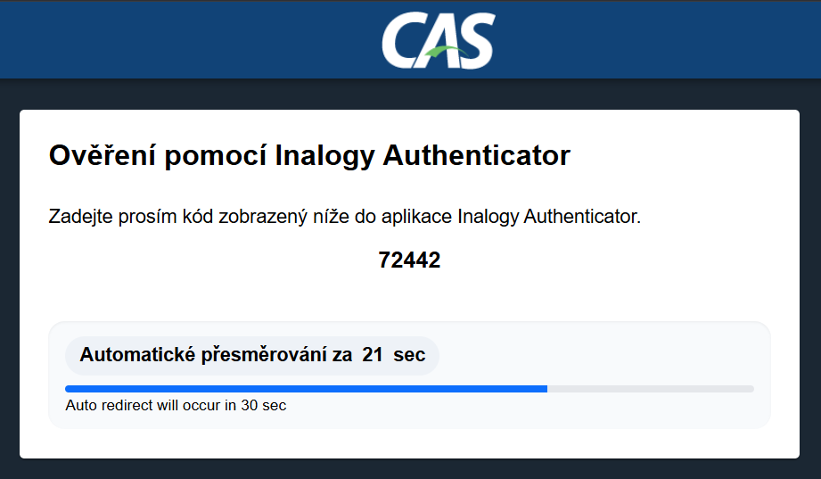
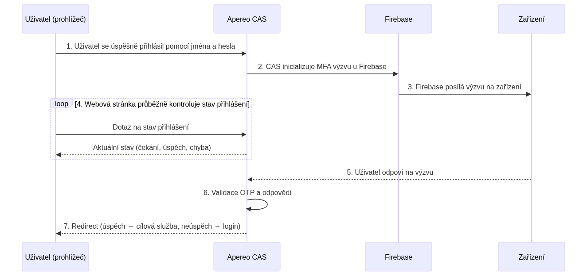
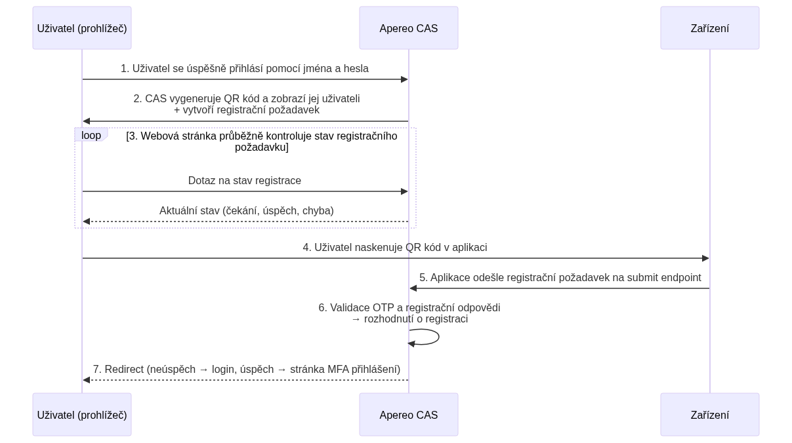

# Dokumentace modulu vícefaktorové autentizace (MFA)

Tato příručka popisuje vlastní modul MFA, který rozšiřuje Apereo CAS o podporu vícefaktorové autentizace prostřednictvím mobilní aplikace Inalogy Authenticator.

## 1. Rychlý přehled

**Účel modulu** – Modul umožňuje centrálnímu autentizačnímu systému (CAS) vyžadovat dodatečný faktor při přihlášení. Podporuje schválení push notifikace v mobilní aplikaci Inalogy Authenticator, zadání jednorázového kódu nebo výběr z nabídky čísel. Modul se integruje jako poskytovatel multifaktoru (MultifactorAuthenticationProvider) a poskytuje vlastní stránky rozhraní.

**Podporované scénáře (flows)** – Modul implementuje tři typy výzev:

- **CHALLENGE_APPROVE** – uživatel schválí přihlášení v aplikaci.
- **CHALLENGE_WRITE** – uživatel opíše jednorázový kód z aplikace do CAS.
- **CHALLENGE_CHOOSE** – uživatel vybere správné číslo z nabídky, které se shoduje s číslem v aplikaci.

**Minimální verze prostředí** – Modul byl vyvíjen a testován s Apereo CAS 7.2.4, 7.2.5 a Java 21.

**Quickstart** – K provozu modulu je třeba:

1. Zkompilovat modul do JAR (`./gradlew build`) nebo stáhnout předpřipravený artefakt.
2. Vložit JAR do adresáře `WEB-INF/lib` nebo přidat závislost do overlay projektu CAS.
3. Do konfiguračního souboru `cas.properties` doplnit potřebné vlastnosti (viz kapitola 5).
4. Pro Linux instalaci restartovat službu CAS; pro OpenShift aktualizovat image nebo ConfigMap a restartovat pod.

**Alternativní způsob** přes Gradle závislost:

1. Přidat do `build.gradle` Maven repozitář.
```gradle
repositories {
    maven {
        url 'https://gitlab.ami.cz/api/v4/projects/708/packages/maven'
        credentials {
            username = 'your-username'
            password = 'your-deploy-token'
        }
    }
```
2. Přidat závislost.
```gradle
dependencies {
    implementation 'cz.ami.cas:mfa-inalogy:x.x.x'
}
```

3. Poté sestavit projekt: `./gradlew build`

> **Poznámka:** Pro přístup k repozitáři bude potřeba osobní deploy token s odpovídajícím username.

## 2. Scénáře použití

### 2.1 Kdy vyžadovat MFA

MFA může být nastaveno na úrovni služby (Service Registry), skupiny uživatelů nebo dle hodnot atributů z LDAP/AD pomocí nástrojů, které jsou již implementovány v Apereo CAS. Příklady použití:

- **Citlivé aplikace** – přihlášení do interních systémů HR, finančních nebo zdravotních aplikací.
- **Externí přístup** – při autentizaci z internetu vyžadovat MFA, zatímco interní přihlášení může zůstat jednofaktorové.
- **Role a atributy** – podle příslušnosti uživatele ke skupině VIP nebo podle výchozího atributu „mfaRequired" v LDAP.

### 2.2 Uživatelský zážitek

**Push schválení (approve)** – Po zadání uživatelského jména a hesla CAS zobrazí stránku „Registrace zařízení" nebo „Potvrďte přihlášení" a odešle push notifikaci do aplikace. Uživatel stiskne „Schválit" v mobilu a CAS okamžitě pokračuje. V případě zamítnutí nebo vypršení časového limitu je přihlášení ukončeno.

**Jednorázový kód (write)** – CAS zobrazí stránku s pole pro zadání kódu. Uživatel otevře aplikaci, přepíše šestiznakový kód a odesláním pokračuje.

**Výběr čísla (choose)** – CAS zobrazí tři čísla; správné číslo se zobrazí v aplikaci. Uživatel klikne na odpovídající číslo.

Ukázky uživatelských obrazovek a tok autentizace je vhodné vložit jako screenshoty ze systému. V dokumentaci je můžete nahradit vloženými obrázky nebo mermaid diagramem, jak je naznačeno v kapitole 3.


### 2.3 Co vidí uživatel během procesu autentifikace:

#### 1. Stránka pro stažení aplikace

Po úspěšném zadání uživatelského jména a hesla se uživateli zobrazí stránka s QR kódem pro stažení aplikace **Inalogy Authenticator** podle typu zařízení (iOS nebo Android). Zobrazení této stránky je ve výchozím nastavení povoleno, ale může být deaktivováno nastavením vlastnosti:

```properties
ami.inalogy.mfa.download.display-download-page=false
```


#### 2. Registrační stránka

Následně je uživatel přesměrován na registrační stránku, kde je potřeba naskenovat QR kód během **30 sekund** (výchozí hodnota, lze upravit vlastností `ami.inalogy.mfa.core.redirect-seconds`). Po vypršení časového limitu je uživatel automaticky přesměrován zpět na přihlašovací stránku.



#### 3. MFA přihlašovací stránka

Po úspěšné registraci, nebo pokud je uživatel již zaregistrován, je přesměrován na stránku MFA přihlášení prostřednictvím potvrzení výzvy (challenge) v mobilní aplikaci. V závislosti na typu výzvy se může zobrazit jedna z následujících stránek:

#### a) Výzva k potvrzení
```properties
ami.inalogy.mfa.core.challenge-type=CHALLENGE_APPROVE
```


#### b) Výzva k výběru
```properties
ami.inalogy.mfa.core.challenge-type=CHALLENGE_CHOOSE
```


#### c) Výzva k zadání
```properties
ami.inalogy.mfa.core.challenge-type=CHALLENGE_WRITE
```


> **Důležité:** Na každé z těchto stránek má uživatel omezený čas pro dokončení přihlášení, po jehož vypršení je automaticky přesměrován zpět na přihlašovací stránku (analogicky k stránce registrace).

## 3. Architektura a tok autentizace

Následující diagram ukazuje základní komponenty a komunikaci při vícefaktorové autentizaci:



Následující diagram ukazuje základní komponenty a komunikaci při registraci zařízení v ramci vícefaktorové autentizaci:



### 3.1 Bod v CAS

Modul se registruje jako `MultifactorAuthenticationProvider` s ID `inalogy-mfa`. Ve webflow se vkládá do stavu `mfaInalogy`, který je volán v případě, že služba nebo pravidlo vyhodnotí potřebu MFA. Detailní specifikace třídy a názvu stavu naleznete v kódu třídy poskytovatele (soubor `InalogyMultifactorAuthenticationProvider.java`) – TODO doplňte odkaz na soubor a popis.

## 4. Integrace s Inalogy Authenticator

### Konfigurované endpointy

Všechny endpointy jsou vystaveny pod kontextovou cestou `/cas/inalogy` a poskytují komplетní funkcionalitu pro správu push autentifikace.

#### 1. Registrace push autentifikace

**Endpoint:** `POST /cas/inalogy/submit`

**Popis:** Registruje nové push autentifikační zařízení pro uživatele. Tento endpoint se používá během počáteční konfigurace push autentifikace.

**Request Body:**

```json
{
  "deviceName": "iPhone 15",
  "pushId": "device-push-token-12345",
  "deviceKeyId": "device-key-identifier-abc123",
  "encodedSecret": "JBSWY3DPEHPK3PXP",
  "deviceType": "IOS",
  "initialCode": "123456"
}
```

**Popis polí:**

- `deviceName` (string, povinné): Čitelný název zařízení (např. "iPhone 15", "Samsung Galaxy")
- `pushId` (string, povinné): Unikátní token/identifikátor pro push notifikace
- `deviceKeyId` (string, povinné): Unikátní identifikátor pro tajný klíč zařízení
- `encodedSecret` (string, povinné): Base32-kódovaný tajný klíč pro generování OTP
- `deviceType` (enum, povinné): Platforma zařízení - buď "IOS" nebo "ANDROID"
- `initialCode` (string, povinné): Počáteční OTP kód pro ověření během registrace

**Odpověď:**
- **204 No Content**: Registrace úspěšná
- **400 Bad Request**: Neplatná nebo chybějící data
- **403 Forbidden**: Registrace nebyla spuštěna nebo neplatný tajný kód

---

#### 2. Validace push autentifikace

**Endpoint:** `POST /cas/inalogy/validate`

**Popis:** Validuje odpověď na push autentifikační výzvu. Tento endpoint je volán, když uživatel odpoví na push notifikaci.

**Request Body:**

```json
{
  "pushId": "device-push-token-12345",
  "otp": "654321",
  "challengeResponse": "user-response-to-challenge"
}
```

**Popis polí:**

- `pushId` (string, povinné): Token/identifikátor pro push notifikace zařízení
- `otp` (string, povinné): Jednorázové heslo pro ověření
- `challengeResponse` (string, povinné): Uživatelova odpověď na autentifikační výzvu (číslo pro CHALLENGE_CHOOSE/CHALLENGE_WRITE, true pro CHALLENGE_APPROVE)

**Odpověď:**
- **204 No Content**: Validace úspěšná
- **400 Bad Request**: Neplatná nebo chybějící data
- **403 Forbidden**: Neplatné OTP nebo odpověď na výzvu

---

#### 3. Ukončení push autentifikace

**Endpoint:** `POST /cas/inalogy/terminate`

**Popis:** Ukončí aktivní push autentifikační relaci. Tento endpoint se používá pro zrušení nebo ukončení procesu push autentifikace.

**Request Body:**

```json
{
  "pushId": "device-push-token-12345",
  "otp": "654321"
}
```

**Odpověď:**
- **204 No Content**: Ukončení úspěšné
- **400 Bad Request**: Neplatná data nebo zařízení nenalezeno
- **403 Forbidden**: Neplatné OTP

---

#### 4. Změna Push ID

**Endpoint:** `POST /cas/inalogy/push-id-change`

**Popis:** Aktualizuje push ID pro existující zařízení. Užitečné při změně tokenu push notifikací (např. po přeinstalaci aplikace).

**Request Body:**

```json
{
  "deviceKey": "device-key-identifier-abc123",
  "pushId": "new-device-push-token-67890",
  "otp": "654321"
}
```

**Odpověď:**
- **204 No Content**: Změna Push ID úspěšná
- **400 Bad Request**: Neplatná data nebo zařízení nenalezeno
- **403 Forbidden**: Neplatné OTP

---

### Formát QR kódu pro registraci

V generovaném QR kódu pro registraci se používají následující data podle standardního TOTP formátu:

```
otpauth://totp/InalogyIAM.io:will.shakes%40playground.stage?
secret=INVDC2SOMNCUENDJGVDUUZDPMVJGO2KO
&digits=6
&mode=push
&algorithm=SHA256
&issuer=InalogyIAM.io
&callback=https%3A%2F%2Fauth.inalogy.io%2Frealms%2Fsaas%2Fpush-auth%2Fexternal%2F05450519-c66d-4d20-b1f2-c849062f5981&
period=30
```

### Struktura polí QR kódu:

- **otpauth://totp** – standardní začátek TOTP QR kódu
- **InalogyIAM.io:will.shakes%40playground.stage** – zobrazená data ve formátu `issuer:username`
- **secret** – TOTP tajný klíč (INVDC2SOMNCUENDJGVDUU...)
- **digits** – počet číslic v TOTP kódu
- **algorithm** – algoritmus pro generování TOTP (SHA256)
- **issuer** – žadatel QR kódu
- **callback** – URL callback služby IAM (např. `https://service.com/cas/inalogy`)
- **period** – interval obnovení TOTP (30 sekund)

> **Konfigurace:** Callback URL se nastavuje pomocí vlastnosti `ami.inalogy.mfa.core.callback-url`

Mobilní aplikace automaticky přidá potřebné endpointy podle typu akce (`/submit` pro ověření odpovědi uživatele atd.).

---

### Komunikace s messaging službou

Při inicializaci MFA přihlášení se na endpoint messaging služby (konfigurovaný vlastností `ami.inalogy.mfa.messaging-service.url`) odesílá následující požadavek s API tokenem v hlavičce `X-API-KEY` s hodnotou z property `ami.inalogy.mfa.messaging-service.api-key`:

#### Push notifikace request

```json
{
  "deviceId": "f47ac10b-58cc-4372-a567-0e02b2c3d479",
  "deviceType": "IOS",
  "title": "Authentication required",
  "body": "Some of your accounts triggered authentication flow. Check it out.",
  "sound": "default",
  "serializedData": "{\"pushType\":\"CHALLENGE_CHOOSE\",\"dataForChallenge\":\"4,3,85\",\"keyId\":\"pushAuth1234\",\"callback\":\"https://example.com/callback\",\"validUntil\":1720000000}"
}
```

#### Popis polí:

- **deviceId** (string): Firebase device ID poskytnuté mobilním telefonem během registrace
- **deviceType** (enum): Typ zařízení - "IOS" nebo "ANDROID"
- **title** (string): Název, který se zobrazí uživateli v push notifikaci
- **body** (string): Zpráva, která se zobrazí uživateli v push notifikaci
- **sound** (string): Zvuk notifikace (výchozí "default")
- **serializedData** (string): Serializovaná data, která mobilní telefon překládá do zobrazených UI elementů

#### Struktura serializedData:

```json
{
  "pushType": "CHALLENGE_CHOOSE",              // Typ výzvy (CHALLENGE_APPROVE, CHALLENGE_WRITE, CHALLENGE_CHOOSE)
  "dataForChallenge": "4,3,85",                // Pro CHALLENGE_CHOOSE: 3 čísla oddělená čárkou. Jinak null
  "keyId": "pushAuth1234",                     // Identifikátor generovaný Firebase aplikací pro specifický tajný klíč uživatele
  "callback": "https://example.com/callback",  // Callback URL - stejná jako v QR kódu
  "validUntil": 1720000000                     // Unix timestamp indikující vypršení výzvy
}
```

#### Typy výzev:

- **CHALLENGE_APPROVE**: Uživatel pouze potvrdí nebo zamítne autentifikaci
- **CHALLENGE_CHOOSE**: Uživatel vybírá ze tří nabídnutých čísel
- **CHALLENGE_WRITE**: Uživatel zadává konkrétní hodnotu

---

### Integrační tok

1. **Registrace**: Použití `/submit` pro registraci nového zařízení
2. **Autentifikace**: Systém odesílá push notifikace, uživatel odpovídá přes `/validate` nebo `/terminate`
3. **Správa**: `/push-id-change` pro aktualizaci device tokenů

## 5. Konfigurace

Třída, ve které jsou dostupné vlastnosti `ami.inalogy.mfa`, dědí z `BaseMultifactorAuthenticationProviderProperties`.  
Díky tomu jsou pro nastavení **InalogyAuthenticatorMultifactorAuthenticationProvider** k dispozici také obecné vlastnosti multifaktorové autentizace.  
Níže uvedená tabulka shrnuje jejich význam:

| Klíč | Typ | Výchozí hodnota | Popis | Příklad |
|------|-----|-----------------|-------|---------|
| `ami.inalogy.mfa.enabled` | boolean | `false` | Globální zapnutí/vypnutí celého Inalogy MFA modulu. | `true` |
| `ami.inalogy.mfa.rank` | integer | – | Číselné pořadí (priorita) poskytovatele MFA. Vyšší hodnota znamená vyšší úroveň zabezpečení – poskytovatel s vyšším rankem přebíjí ostatní. | `10` |
| `ami.inalogy.mfa.order` | integer | `Integer.MAX_VALUE` | Pořadí autentizačního handleru v řetězci zpracování. Určuje, kdy bude handler vyvolán. | `1` |
| `ami.inalogy.mfa.id` | string | – | Jedinečný identifikátor MFA poskytovatele. Nutné nastavit pouze v případě, že v CAS běží více instancí stejného typu poskytovatele. | `mfa-inalogy` |
| `ami.inalogy.mfa.bypass` | objekt | – | Pravidla pro obejití (bypass) MFA. Lze definovat podmínky, za kterých CAS MFA přeskočí. | – |
| `ami.inalogy.mfa.name` | string | – | Název autentizačního handleru použitý při ověřování přihlašovacích údajů v MFA. Pokud existuje více handlerů stejného typu, musí mít jedinečné názvy. | `InalogyMfaHandler` |
| `ami.inalogy.mfa.failureMode` | enum | `CLOSED` | Politika selhání pro poskytovatele MFA. Určuje, jak se CAS chová, pokud není poskytovatel dostupný. | `OPEN` |

### Možné hodnoty `failureMode`
- `OPEN` – CAS povolí pokračovat bez MFA, ale MFA nebude reportováno RP.
- `CLOSED` – CAS zastaví autentizaci (výchozí).
- `PHANTOM` – CAS povolí pokračovat, ale MFA přesto nahlásí RP.
- `NONE` – Selhání se vůbec nevyhodnocuje.
- `UNDEFINED` – Žádný mód není nastaven.

> Doporučení: V produkci je běžně využíván režim **CLOSED**, aby nedošlo k obejití MFA při výpadku poskytovatele.

### Core (ami.inalogy.mfa.core.*)

| Klíč | Typ | Výchozí hodnota | Popis | Příklad |
|------|-----|-----------------|-------|---------|
| `ami.inalogy.mfa.core.issuer` | string | `CAS-Apereo` | Issuer použitý v registračním QR/URL (identifikace CAS). | `CAS-Prod` |
| `ami.inalogy.mfa.core.label` | string | `Inalogy-IAM.io` | Popisek v registračním QR/URL (zobrazen v aplikaci). | `Company-SSO` |
| `ami.inalogy.mfa.core.callbackUrl` | URL | – | URL, na kterou se přesměruje po úspěšném ověření/registraci. | `https://login.example.cz/cas/login?service=https%3A%2F%2Fapp.example.cz` |
| `ami.inalogy.mfa.core.hmacHashFunction` | string | `HmacSHA256` | Hash funkce pro generování TOTP/OTP. | `HmacSHA1` |
| `ami.inalogy.mfa.core.challengeType` | string | `CHALLENGE_WRITE` | Typ MFA výzvy (např. `CHALLENGE_WRITE`, `CHALLENGE_APPROVE`, `CHALLENGE_CHOOSE`). | `CHALLENGE_APPROVE` |
| `ami.inalogy.mfa.core.keyRepresentation` | enum | `BASE32` | Formát reprezentace tajného klíče. | `BASE32` |
| `ami.inalogy.mfa.core.codeDigits` | integer | `6` | Počet číslic OTP kódu. | `6` |
| `ami.inalogy.mfa.core.keyModulus` | integer | `1000000` | Modulus pro výpočet kódu (odvozeno z `codeDigits`). | `1000000` |
| `ami.inalogy.mfa.core.secretKeySize` | integer (bits) | `160` | Délka tajného klíče v bitech. | `160` |
| `ami.inalogy.mfa.core.windowSize` | integer | `3` | Tolerance časových oken pro TOTP (počet kroků). | `3` |
| `ami.inalogy.mfa.core.timeStepSize` | integer (sec) | `30` | Platnost jednoho TOTP kroku v sekundách. | `30` |
| `ami.inalogy.mfa.core.multipleDeviceRegistrationEnabled` | boolean | `false` | Povolit více registrovaných zařízení na uživatele. | `true` |
| `ami.inalogy.mfa.core.deviceRegistrationEnabled` | boolean | `true` | Povolit registraci zařízení/účtů. | `true` |
| `ami.inalogy.mfa.core.trustedDeviceEnabled` | boolean | `false` | Povolit režim „důvěryhodných zařízení“. | `false` |
| `ami.inalogy.mfa.core.redirectSeconds` | integer (sec) | `30` | Počet sekund do automatického přesměrování (např. po registraci/úspěchu). | `45` |
| `ami.inalogy.mfa.core.timeoutMs` | integer (ms) | `40000` | Celkový timeout pro čekání/operace související s výzvou. | `45000` |

### Download page (ami.inalogy.mfa.download.*)

| Klíč | Typ | Výchozí hodnota | Popis | Příklad |
|------|-----|-----------------|-------|---------|
| `ami.inalogy.mfa.download.displayDownloadPage` | boolean | `true` | Zobrazit stránku se stažením aplikace a QR. | `true` |
| `ami.inalogy.mfa.download.googlePlayAppUrl` | URL | `https://play.google.com/store/apps/details?id=com.inalogy.pushauthenticator` | Odkaz na aplikaci v Google Play. | `https://play.google.com/store/apps/details?id=com.inalogy.pushauthenticator` |
| `ami.inalogy.mfa.download.appStoreAppUrl` | URL | `https://apps.apple.com/us/app/inalogy-authenticator` | Odkaz na aplikaci v Apple App Store. | `https://apps.apple.com/us/app/inalogy-authenticator` |

### Messaging service (ami.inalogy.mfa.messaging-service.*)

| Klíč | Typ | Výchozí hodnota | Popis | Příklad |
|------|-----|-----------------|-------|---------|
| `ami.inalogy.mfa.messaging-service.url` | URL | – | Základní URL API pro odesílání push/výzev. **Povinné v produkci.** | `https://api.inalogy.example.com` |
| `ami.inalogy.mfa.messaging-service.apiKey` | string | – | API klíč pro autentizaci k Messaging Service. Doporučeno načítat z Vaultu/Secret. | `${VAULT_INALOGY_MESSAGING_API_KEY}` |

> Poznámky:
> - `keyModulus` je odvozen z `codeDigits` (`10^codeDigits`) a v praxi se obvykle explicitně nenastavuje.
> - U citlivých hodnot (např. `apiKey`) používejte Vault/Secrets a neukládejte je přímo do verzovaných konfigurací.

## 6. Monitoring a logování

### Konfigurace logování pro vlastní modul

Následující postup ukazuje, jak povolit a řídit logování pro vlastní modul pomocí Log4j2.  
Cílem je mít samostatný logger pro balíček vašeho modulu (např. `cz.ami.cas`) a možnost měnit úroveň logování přes konfigurovatelnou vlastnost.

### Úprava `log4j2.xml` – sekce `<Loggers>`

Do sekce `<Loggers>` přidejte definici loggeru pro váš balíček (změňte `name` podle skutečného package):

```xml
<Loggers>
    <!-- ... ostatní loggery ... -->
    <Logger name="cz.ami.cas" level="${sys:cas.inauth.log.level}" additivity="false">
        <AppenderRef ref="casConsole"/>
        <AppenderRef ref="casFile"/>
    </Logger>
    <!-- Kořenový logger -->
    <Root level="info">
        <AppenderRef ref="casConsole"/>
        <AppenderRef ref="casFile"/>
    </Root>
</Loggers>
```

- `name` odpovídá kořenovému balíčku MFA modulu (např. třídy v `cz.ami.cas.*`).
- `level` používá systémovou vlastnost `${sys:cas.inauth.log.level}` — díky tomu lze úroveň snadno měnit bez zásahu do XML.
- `additivity="false"` zajistí, že logy nebudou „bublat" do nadřazených loggerů (duplicitní zápisy).
- `AppenderRef` směřuje logy do existujících CAS appenderů (konzole a soubor). Lze použít i jiné/rolující appendery, pokud je máte definované.

### Úprava `log4j2.xml` – sekce `<Properties>`

Do sekce `<Properties>` přidejte výchozí hodnotu vlastnosti:

```xml
<Properties>
    <!-- ... jiné vlastnosti ... -->
    <Property name="cas.inauth.log.level">trace</Property>
</Properties>
```
**Důležité:** Název vlastnosti v `<Property name="...">` musí korespondovat s částí za `sys:` v definici loggeru (`${sys:cas.inauth.log.level}` ⇒ `cas.inauth.log.level`).

## 7. Řešení problémů (Troubleshooting)

| Symptom | Možná příčina | Kde hledat | Doporučené řešení |
|---------|---------------|------------|-------------------|
| Uživateli se nezobrazí MFA stránka | Služba nemá nastaveno MFA; `cas.mfa.inalogy.enabled=false` | Registry služeb, application.yml | Aktivujte MFA pro službu nebo globálně |
| Push notifikace nepřijde | Mobilní aplikace není registrovaná / špatný API klíč | Logy MFA modulu, API Inalogy | Zkontrolujte registraci zařízení a platnost klíče |


